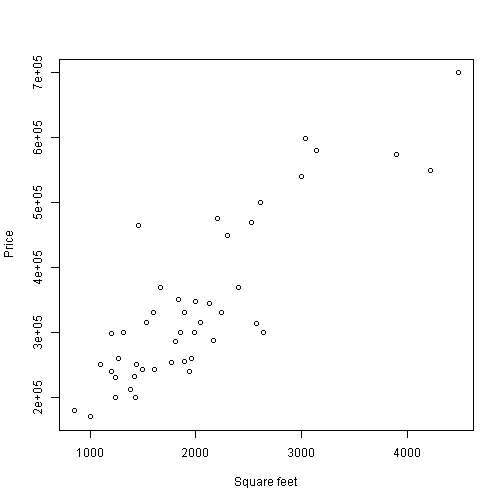
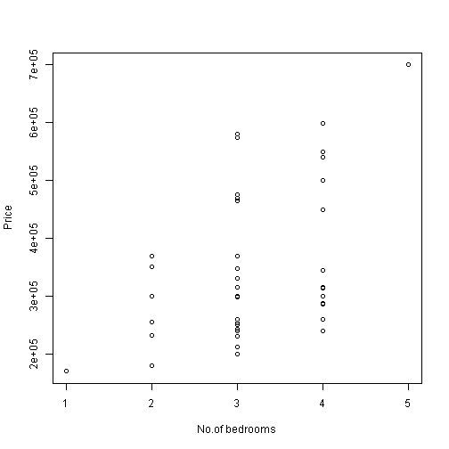

## Application to predict housing prices

1. As a real estate broker or as a person wanting to buy / sell a house, you would like to know the selling price of the house
2. Using historical price data, we can predict the selling price of a house given the features
3. In this particular application, the square feet of the house and number of bedrooms are taken as input variables for prediction

--- .class #id 

## Relationship between price and square feet


```r
with(historical_prices,plot(sqfeet,price,xlab="Square feet",ylab="Price"))
```

 

---

## Relationship between price and number of bedrooms


```r
with(historical_prices,plot(numbedrooms,price,xlab="No.of bedrooms",ylab="Price"))
```

 

---

## How the Prediction is carried out?

1. Using historical data, a multiple linear regression model is created utilizing the 'lm' function in R

2. For any value that is provided by the user for area in square feet and number of bedrooms, the model predicts the price of the house

3. This price can be used by the user to take appropriate decisions

---

## Supervised Learning vs Unsupervised Learning

1. Multiple linear regression falls in the category of 'Supervised Learning' and it is typically used for predicting continuous variables

2. To use the linear regression model, the pre-requisite is that the response variable should be normally distributed

3. If the distribution is not normal, then a 'Generalized Linear Model' should be used

4. 'Unsupervised Learning' is used in cases where the output variable does not have labels associated with it

